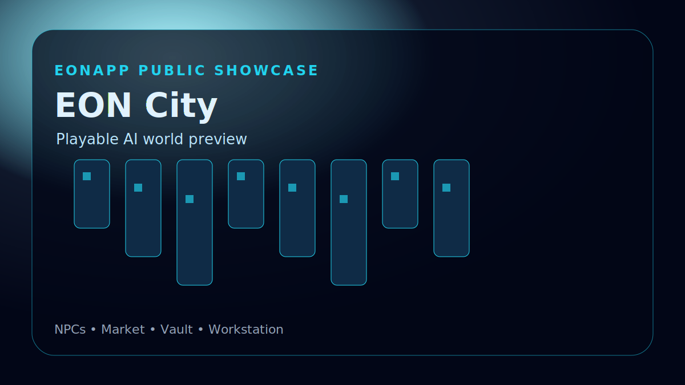
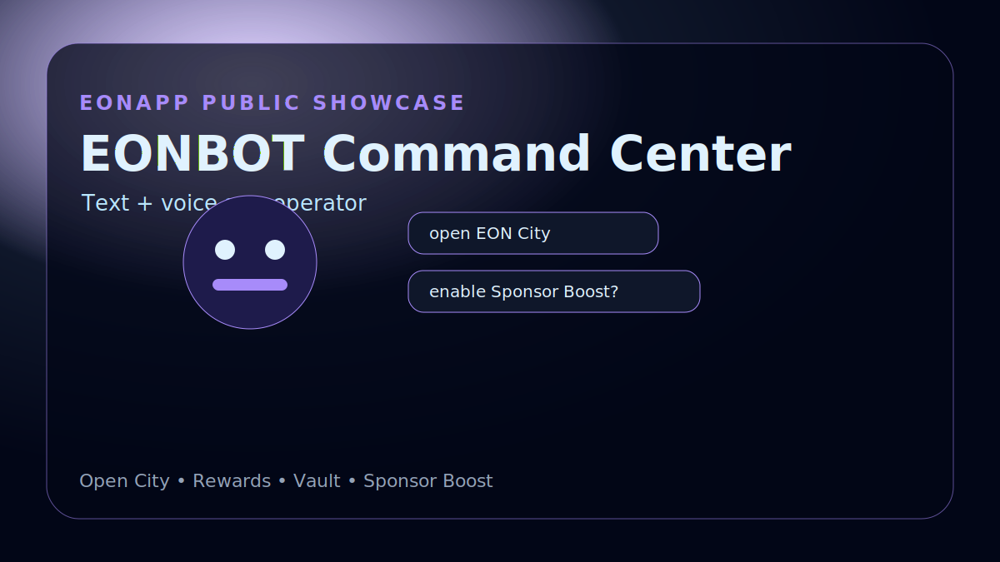
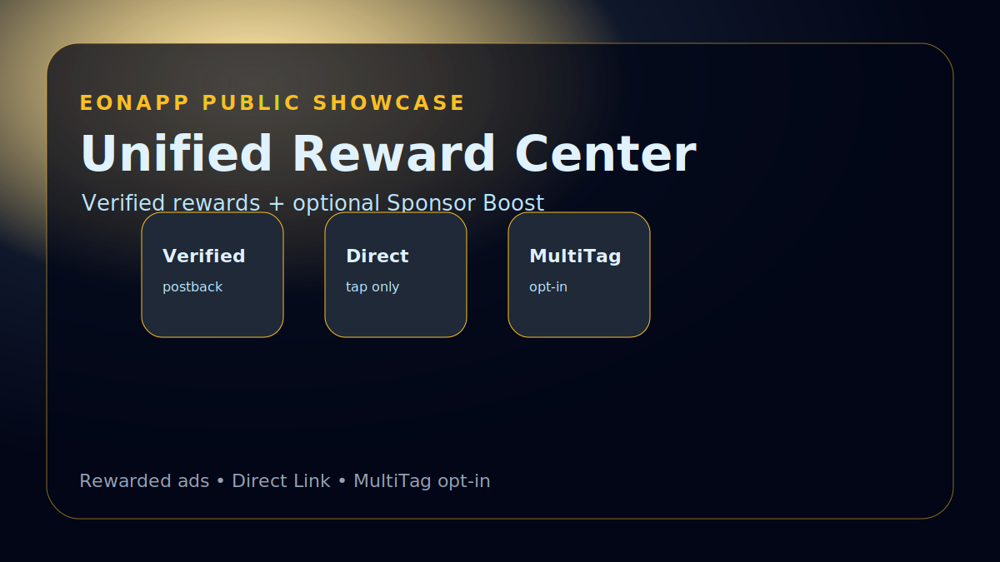
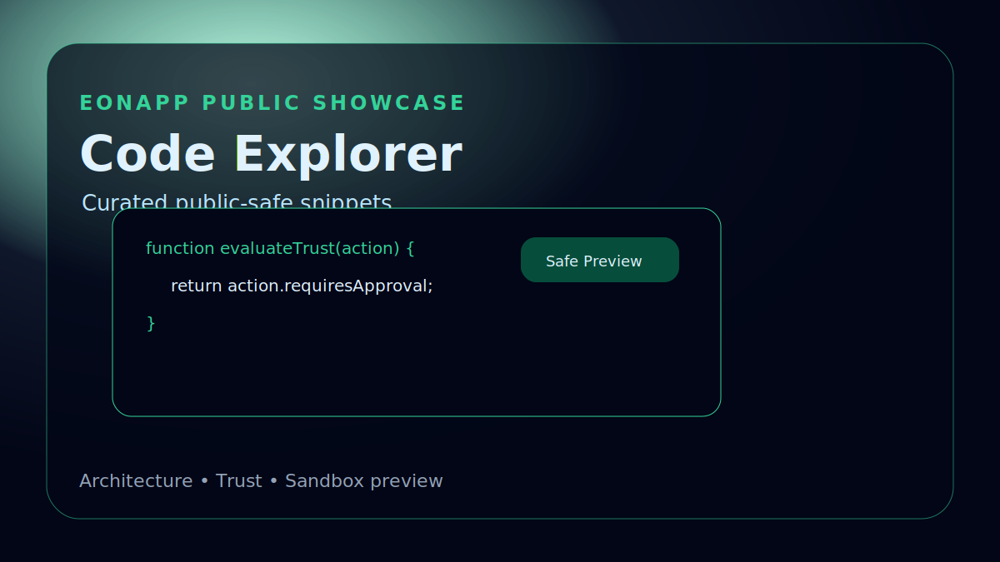
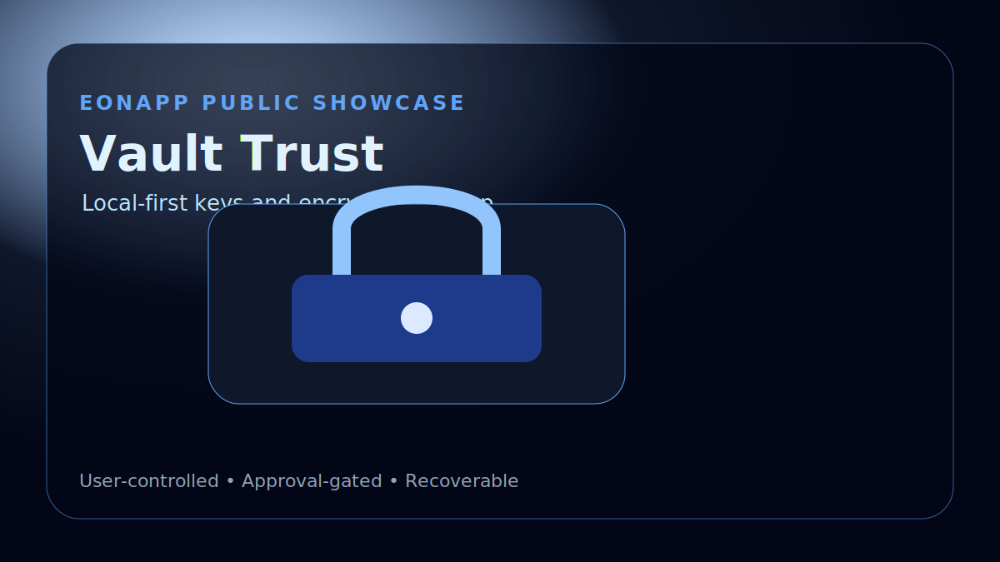
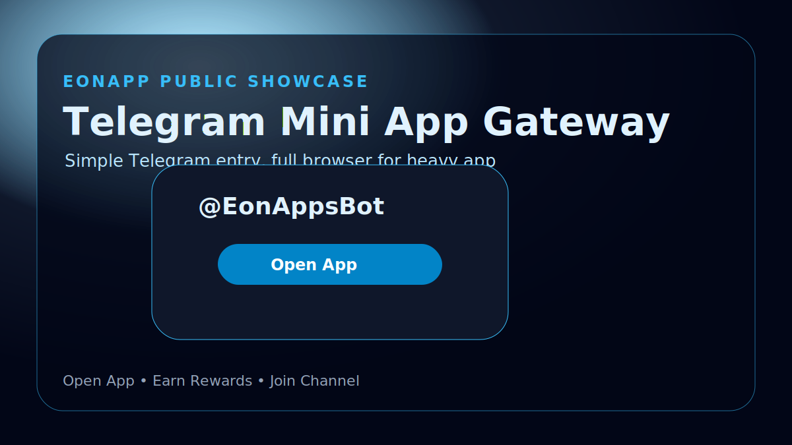

# EONAPP Public Code Showcase


EONAPP is an AI app world with EON City, EONBOT, Vault, Market, Reward Center, Telegram Mini App entry, and curated code-preview surfaces.

This repository is a **public-safe code and architecture showcase**. It is designed to prove the product philosophy and safety model without exposing the full private application source.

## Screenshots

| EON City | EONBOT | Reward Center |
|---|---|---|
|  |  |  |

| Code Explorer | Vault Trust | Telegram Gateway |
|---|---|---|
|  |  |  |

## What is included

- Public-safe screenshots and visual previews.
- Curated code snippets showing the trust model.
- Architecture notes explaining what is local-first, approval-gated, opt-in, and verified.
- A safe preview demo that can run locally in the browser.
- A boundary scan that blocks accidental secrets or private-source claims.

## What is not included

- Full EONAPP private source code.
- Production `.env` files or secrets.
- Telegram bot token, Cloudflare secrets, Monetag secrets, Filebase keys, NOWPayments secrets, wallet private keys.
- Full marketplace, orchestration, deployment, payment, or monetization internals.
- Proprietary EON City world implementation.

## Selected trust snippets

- [`src/snippets/approval-gate.js`](src/snippets/approval-gate.js)
- [`src/snippets/vault-local-first.js`](src/snippets/vault-local-first.js)
- [`src/snippets/sponsor-boost-policy.js`](src/snippets/sponsor-boost-policy.js)
- [`src/snippets/eonbot-command-router.js`](src/snippets/eonbot-command-router.js)
- [`src/snippets/mobile-game-ui-guard.js`](src/snippets/mobile-game-ui-guard.js)
- [`src/snippets/telegram-miniapp-browser-bridge.js`](src/snippets/telegram-miniapp-browser-bridge.js)
- [`src/snippets/nft-starter-drop-persistence.js`](src/snippets/nft-starter-drop-persistence.js)

## Run the public safety check

```bash
npm test
```

The scan confirms this public repo does not contain common secret names, `.env` files, or private-source language mistakes.

## Trust model summary

EONAPP follows these public rules:

1. **Local-first Vault**: user secrets and backups are designed to stay user-controlled.
2. **Approval-gated actions**: wallet/payment/backup/microphone/ad opt-in actions require user confirmation.
3. **Clean default app**: Sponsor Boost is optional, off by default, and can be turned off.
4. **Verified rewards only**: real account-wide rewards require provider proof/postback, not just a local click.
5. **Mobile game UX**: EON City panels must be closable/minimizable so gameplay is not blocked.
6. **Public code boundary**: this repo proves design and safety, not the full private implementation.

## In-app Code Explorer plan

The private EONAPP app includes a Code Showcase / Trust Explorer route. It should use the same curated snippets from this repository and clearly label them as public-safe examples.

See [`docs/in-app-code-preview-plan.md`](docs/in-app-code-preview-plan.md).
